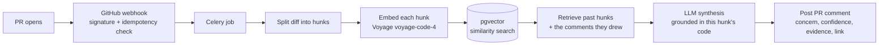

# CodeLens

Historical PR review retrieval and code-grounded pre-review feedback for GitHub, evaluated end to end.

I built this because I kept running into the same problem: you open a PR and wait hours for a senior engineer to point out something that's already been flagged a hundred times before on similar code. CodeLens indexes historical PR review comments, grounds them to the exact code they were left on, and posts a synthesized pre-review briefing the moment a new PR opens. I backed it with a real, measured evaluation loop instead of just claiming it works.

## The core idea: hunk-grounded retrieval

My first instinct was to embed the review comment text itself and search over that. It doesn't work well. It retrieves generic advice like "add a test" or "handle the error" with no way to tell whether that advice actually applies to the specific new code being reviewed.

GitHub's review-comment API pairs every historical comment with the exact code it was left on, its `diff_hunk`. So I index `(diff_hunk → comment)` pairs and embed the code itself, not the comment text. When a PR opens, each changed hunk gets embedded the same way and matched against this corpus. Retrieval is grounded in code similarity, and synthesis is grounded in the actual new code, not just whatever comments got retrieved in isolation.

## Architecture



The posted comment shows its work. Every finding links back to the specific historical GitHub comment that justified it, so it's provenance, not a black box.

## Example output

This is real: a hunk from an actual `tiangolo/fastapi` PR, run through the current pipeline against the real corpus (not posted to GitHub, just generated locally to show the format).

The changed code:

```yaml
-          version: "0.11.18"
+          version: "0.11.30"
+          cache-suffix: dev-all
```

What CodeLens produced:

> ### Finding 1: Adding a cache-suffix without enabling the cache may leave caching disabled for this job *(inferred)*
> **Confidence:** 92% | **Suggested check:** Confirm that `enable-cache: true` is set (or that caching is otherwise enabled) for this step
>
> **Similar past code** — `.github/workflows/smokeshow.yml` (similarity: 88%):
> ```yaml
> cache-suffix: github-actions
> ```
> **Past reviewer said:** *"Since setup-uv v10.0.0, cache for this workflow is disabled... I think we can safely enable it..."* ([view original](https://github.com/fastapi/fastapi/pull/16152#discussion_r3864473925))
>
> **Evidence:** Past comment notes that after setup-uv v10.0.0 the cache is disabled unless `enable-cache: true` is set, and only a cache-suffix was added here.

## Tech stack

| Tool | Role |
|---|---|
| FastAPI | Webhook ingestion, API endpoints |
| PostgreSQL + pgvector | Vector search over code embeddings (Neon, free tier) |
| SQLAlchemy + Alembic | ORM and schema migrations |
| Voyage AI | Embeddings: `voyage-code-4` for code retrieval, `voyage-4-lite` for natural-language matching |
| Groq | LLM for synthesis and the evaluation judge (`openai/gpt-oss-120b`, free tier, no billing account required) |
| Celery + Redis | Background job queue (Upstash, free tier) |
| GitHub App + Webhooks | Auth and event delivery |
| structlog | Structured logging with request-id tracing |
| Docker + Compose | One-command local setup |
| pytest | Unit + integration tests |

Every piece runs on a genuinely free tier. See [Why Groq](#why-groq) for why the LLM provider changed mid-project.

## Evaluation

I wanted a way to actually check whether this system works, not just claim it does, so CodeLens measures itself against a held-out set of real comments from independent maintainers who've never seen CodeLens, using a chronological split, a stratified tune/test split by repo, and an independent LLM judge as the final match decision, not raw similarity. Full method and the complete run-by-run history are in [`docs/evaluation.md`](docs/evaluation.md); every run is also persisted as a full JSON artifact in `app/scripts/eval_runs/`.

**Cold-start** here means the share of held-out test samples for which no retrieved candidate cleared the similarity floor at all, so the system had nothing to compare against.

| Version | Change | Result |
|---|---|---|
| v1 | Raw similarity, threshold tuned and reported on the same 15 samples | 37.5% precision, methodologically optimistic |
| v2 | Added an independent LLM judge | 4.7% precision (n=24 test set) |
| v3 | Grounded synthesis in the actual new-PR code | 83.3% precision on the tune set (5 of 6, n=14), but recall collapsed on the test set |
| v4 | Grew the corpus from 287 to 653 comments across 5 repos | A naive pooled split let one very-active repo eat 83% of the test set |
| v5 | Stratified the split by repo | Balanced representation, but cold-start rose to ~71% (17 of 24) |
| v6 | Found and removed 3 ground-truth comments that were another automated tool's output | Corpus integrity fix, filter added to prevent recurrence |

Where things actually stand: the corpus construction, matching pipeline, and evaluation procedure are implemented and reproducible, not proven correct. Sample sizes (14-35 per run) are still small enough that any single precision, recall, or F1 number should be read as directional. The dominant bottleneck right now is retrieval cold-start on topically distant repos, not synthesis or judging quality.

## Known limitations

- **Cold-start, around 70%.** Most held-out test hunks retrieve nothing above the similarity floor. That's a corpus-coverage problem, not a matching-quality problem.
- **Domain transfer is weak.** Code-similarity retrieval works within a topical neighborhood, like web frameworks or HTTP clients, and doesn't reliably transfer to a structurally different domain such as a validation library.
- **Small sample sizes.** 14 to 35 samples per run means any single number carries a wide confidence interval.
- **GitHub's `/pulls/comments` listing seems to cap out around 120-130 comments per repo** regardless of activity level. I haven't confirmed whether that's a hard API limit or an artifact of the current fetch strategy. Full detail in [`docs/evaluation.md`](docs/evaluation.md).
- **`temperature: 0` reduces but doesn't guarantee bit-for-bit determinism.** Verdicts are stable across repeated calls; exact wording occasionally isn't, which is a known property of this kind of inference, not a bug here.

## Why Groq

I originally built this on Gemini for its free tier. Mid-project, the Google Cloud project behind my API key got denied access at the account level, and fixing it meant a mandatory $5 prepay plus moving the entire project to paid-tier pricing, not just unlocking one model. Rather than break my zero-cost constraint, I moved to Groq, which gives a genuinely free, rate-limited tier with no billing account required.

## Repository structure

```
app/
  core/       config, database connection, Celery app, middleware
  models/     SQLAlchemy models (repos, review comments, predictions, false negatives, processed PRs)
  routers/    FastAPI routes (repos, webhook, metrics)
  services/   retrieval, synthesis, ingestion, evaluation, GitHub client/auth, LLM client
  tasks/      Celery task definitions
  scripts/    backfills, corpus ingestion, and the held-out evaluation script
alembic/      database migrations
tests/        pytest suite
docs/         evaluation history and other detail moved out of the main README
```

## Running it

### Locally

```bash
python -m venv venv && source venv/bin/activate
pip install -r requirements.txt
cp .env.example .env   # fill in your own values
alembic upgrade head
uvicorn app.main:app --reload
```

### With Docker

```bash
docker compose up --build
```

Runs the API on `:8000`, a Celery worker, and Flower on `:5555`. It connects out to your existing managed Postgres and Redis (Neon and Upstash) through `.env`, so there are no local database containers, which matches how I actually run this. The GitHub App private key gets mounted read-only from the repo root; update the filename in `docker-compose.yml` if the key ever gets rotated.

### Tests

```bash
pytest
```

Covers diff parsing, the matching and scoring engine, markdown formatting, synthesis output filtering (including a regression test for a negative-index bug I found while writing these), and a DB-free integration test of the webhook and health endpoints.

## Scaling this further

I deliberately left out Kafka, Kubernetes, an MCP server, ReAct agents, and multi-tenancy to keep the zero-cost constraint and go deep on retrieval and evaluation instead of breadth. At real scale I'd add a message queue in front of the webhook for burst handling, per-tenant corpus isolation, and a proper A/B framework for prompt and threshold changes instead of the sequential eval-and-compare loop I'm running now.
